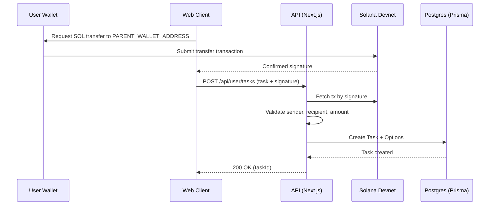
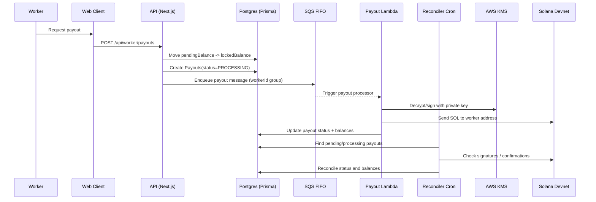

# Crowdmint

Crowdmint is a Solana-based crowdsourcing app where users fund tasks and workers earn rewards for submissions. This README documents the system design for the **deposit** (task funding) and **withdrawal** (worker payout) flows based on the current codebase.

## System Design: Deposit Flow (Task Funding)

**Goal:** A task creator funds a task by transferring SOL to the platform wallet, then registers the task on-chain proof and metadata in the database.



**Primary flow (client + API):**
1. **User wallet transfer (client):** The task creator sends SOL from their wallet to the platform wallet (`PARENT_WALLET_ADDRESS`).  
   - Client code: `src/components/user/Upload.tsx`
2. **Confirm transaction (client):** The client waits for the transaction confirmation and captures the transaction signature.
3. **Create task (API):** The client submits task details + the signature to the API.  
   - API: `POST /api/user/tasks` in `src/app/api/user/tasks/route.ts`
4. **Server-side validation (API):**
   - Fetches the transaction from Solana devnet and verifies:
     - **Amount** matches the submitted task amount.
     - **Recipient** is the platform wallet (`PARENT_WALLET_ADDRESS`).
     - **Sender** matches the user’s registered wallet address.
5. **Database write (API):**
   - Creates a `Task` record with amount stored in lamports.
   - Creates `Option` records for the uploaded images.

**Key invariants:**
- Tasks are only created if the on-chain transfer is valid for **amount**, **destination**, and **sender**.
- Amount is stored in lamports for consistency (`LAMPORTS_PER_SOL`).

## System Design: Withdrawal Flow (Worker Payout)

**Goal:** Workers accumulate pending earnings from submissions and can request payouts. Payout requests are queued and processed asynchronously, one by one, using a Lambda worker that signs transfers via AWS KMS.



**On-chain earnings accumulation (API):**
1. **Worker submits a task (API):**  
   - API: `POST /api/worker/submission` in `src/app/api/worker/submission/route.ts`
2. **Pending balance increments (DB):**
   - Each submission credits the worker’s `pendingBalance` by `task.amount / task.maximumSubmissions`.

**Payout request + queueing (API):**
1. **Worker requests payout (API):**  
   - API: `POST /api/worker/payouts` in `src/app/api/worker/payouts/route.ts`
2. **Atomic balance move + payout record (DB transaction):**
   - Move `pendingBalance -> lockedBalance`
   - Create a `Payouts` record with `status = PROCESSING`
3. **Queue message (SQS FIFO):**
   - Send a message to the payout queue (`SQS_URL`) with:
     - `payoutId`, `workerId`, `workerAddress`, `amount`
   - FIFO queue ensures **per-worker ordering** via `MessageGroupId = workerId`.

**Async payout execution (Lambda worker):**
1. **Queue-triggered Lambda consumes messages one by one.**
2. **Lambda retrieves the private key from AWS KMS.**
3. **Lambda signs and broadcasts the SOL transfer** from the platform wallet to the worker’s address.
4. **Lambda updates payout status** (`SUCCESS` / `FAILED`) and clears `lockedBalance` appropriately.  
   - Note: This Lambda code is not in this repo; it is assumed to be deployed separately.

**Reconciliation cron (external):**
1. **Cron scans pending/processing payouts** and checks on-chain confirmations.
2. **Cron updates payout statuses** and ensures balances match on-chain reality.  
   - Note: This cron job is not in this repo; it is assumed to be deployed separately.

## Key Data Models (Prisma)

- `Task`: funded tasks (stores signature, amount in lamports, and options)
- `Submission`: worker task submissions (records earned amount)
- `Worker`: maintains `pendingBalance` and `lockedBalance`
- `Payouts`: payout requests and status

Schema: `prisma/schema.prisma`

## API Surface Relevant to Flows

- **Deposit / Task funding**
  - `POST /api/user/tasks` → create a funded task after verifying on-chain transfer
- **Worker earnings**
  - `POST /api/worker/submission` → record submission and increment `pendingBalance`
- **Withdrawal / Payout**
  - `POST /api/worker/payouts` → lock funds and enqueue payout message

## Operational Notes

- **Queueing:** FIFO SQS ensures sequential payout processing per worker.
- **Signing:** The withdrawal signer key is secured in AWS KMS, not in the app.
- **Reconciliation:** A scheduled cron job confirms pending transactions and reconciles payout status.
- **Idempotency:** Queue messages are deduplicated using `payout.id + timestamp`.
- **Environment variables:** `REGION`, `ACCESS_KEY`, `SECRET_KEY`, `SQS_URL` are required for payout queueing.

## Local Development

```bash
npm run dev
```
